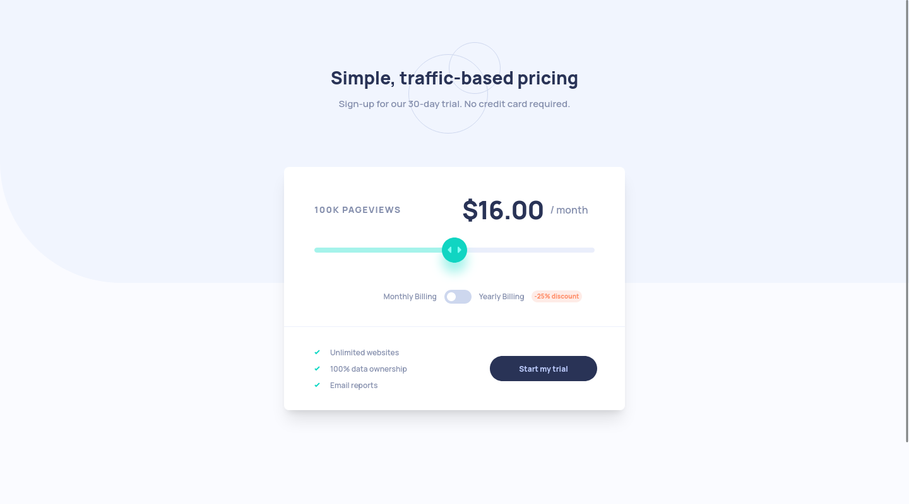

# Frontend Mentor - Interactive pricing component solution

This is a solution to the [Interactive pricing component challenge on Frontend Mentor](https://www.frontendmentor.io/challenges/interactive-pricing-component-t0m8PIyY8). Frontend Mentor challenges help you improve your coding skills by building realistic projects. 

## Table of contents

- [Overview](#overview)
  - [The challenge](#the-challenge)
  - [Screenshot](#screenshot)
  - [Links](#links)
- [My process](#my-process)
  - [Built with](#built-with)
  - [What I learned](#what-i-learned)
  - [Continued development](#continued-development)
  - [Useful resources](#useful-resources)
- [Author](#author)

## Overview

### The challenge

Users should be able to:

- View the optimal layout for the app depending on their device's screen size
- See hover states for all interactive elements on the page
- Use the slider and toggle to see prices for different page view numbers

### Screenshot

### Links

- Solution URL: [GitHub](https://github.com/GrzywN/interactive-pricing-component-main)
- Live Site URL: [Netlify](https://chipper-figolla-db89cb.netlify.app/)

## My process

### Built with

- Semantic HTML5 markup
- CSS custom properties
- Flexbox / CSS Grid
- Mobile-first workflow

- [React](https://reactjs.org/) - JS library
- [Framer Motion](https://www.framer.com/motion/) - React animation library
- [Tailwind CSS](https://tailwindcss.com/) - CSS framework
- [Styled Components](https://styled-components.com/) - For styles
- [Vite](https://vitejs.dev/) - Bundler / Runtime
- [Vitest](https://vitest.dev/) - Testing library
- [ESLint](https://eslint.org/) - Linter
- [Prettier](https://prettier.io/) - Code formatter

### What I learned

I learned how to deal with conditional rendering and how to use styled components.

### Continued development

I'll come back some time in the future to this project to improve it and write unit tests.

### Useful resources

- [Tailwind Cheat Sheet](https://nerdcave.com/tailwind-cheat-sheet)
- [Framer Motion for React Tutorial](https://www.youtube.com/playlist?list=PL4cUxeGkcC9iHDnQfTHEVVceOEBsOf07i)
- [React - The Complete Guide (incl Hooks, React Router, Redux)](https://www.udemy.com/course/react-the-complete-guide-incl-redux/)
- [Range Input with React & Styled components](https://www.youtube.com/watch?v=99rxURmD59E)

## Author

- Frontend Mentor - [@GrzywN](https://www.frontendmentor.io/profile/GrzywN)
- Twitter - [@GrzywN](https://www.twitter.com/GrzywN)
